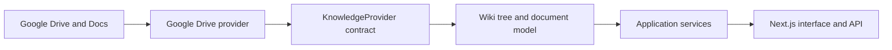

<div align="center">

# FolioWiki

### Your docs are already written. Make them a wiki.

**FolioWiki turns a Google Drive folder into a calm, navigable knowledge base—without moving your documents or creating a second editor.**

<p>
  <a href="https://github.com/igorwfaoro/foliowiki">GitHub repository</a>
  · <a href="#get-started">Get started</a>
  · <a href="docs/architecture.md">Architecture</a>
</p>


</div>

---

> **Google Drive stays the source of truth. FolioWiki is the knowledge layer.**

Teams already write in Google Docs. FolioWiki is being built to make that knowledge easier to browse, search, and share—while the original files and their Drive permissions stay where they are.

## Why FolioWiki?

- **Keep your content where it is.** No migration, duplicate documents, or new editing workflow.
- **Navigate knowledge, not a file manager.** Turn an existing Drive folder structure into a readable wiki experience.
- **Respect existing access.** Google Drive permissions remain authoritative; FolioWiki must never make content more accessible than its source.
- **Build on an open boundary.** A provider-neutral core makes room for future content sources without coupling the wiki to Google APIs.

## How it works



The intended flow translates Google-specific API responses into FolioWiki's internal document model before they reach the application. This keeps rendering, navigation, and search contracts portable.

## Project status

FolioWiki is in **early development**. The current work establishes the product shell and provider-neutral core; the end-to-end Google Drive wiki experience is the V1 direction, not a claim that every planned capability is already available.

The V1 is being shaped around Google sign-in, choosing a Drive folder, browsing folders and Docs, readable document pages, search, and links back to Google Docs for editing. See the [product brief](PRODUCT.md) for scope and non-goals.

## Get started

### Requirements

- Node.js 22 (the version used by the Docker image)
- npm
- A Google Cloud project with OAuth configured to use Google Drive and Google Docs ([setup guide](docs/google-setup.md))

### Run locally

```bash
git clone https://github.com/igorwfaoro/foliowiki.git
cd foliowiki
npm install
cp .env.example .env
```

Add your local OAuth configuration to `.env`, then start the development server:

```bash
npm run dev
```

Open [http://localhost:3000](http://localhost:3000). For the Google Cloud and OAuth steps, follow the [Google setup guide](docs/google-setup.md).

### Run with Docker

```bash
cp .env.example .env
# Add your local OAuth configuration to .env
docker compose up --build
```

Then open [http://localhost:3000](http://localhost:3000). See [deployment](docs/deployment.md) for the production runtime details.

### Environment variables

| Variable                      | Purpose                                                                                 |
| ----------------------------- | --------------------------------------------------------------------------------------- |
| `AUTH_SECRET`                 | Secret used by Auth.js.                                                                 |
| `GOOGLE_CLIENT_ID`            | Google OAuth client ID.                                                                 |
| `GOOGLE_CLIENT_SECRET`        | Google OAuth client secret.                                                             |
| `GOOGLE_DRIVE_ROOT_FOLDER_ID` | Optional default wiki root; V1 is designed to let users choose a folder in the product. |

Use `.env.example` as the template. **Never commit `.env`, OAuth credentials, or refresh tokens.**

## Design principles

| Principle                   | What it means                                                                           |
| --------------------------- | --------------------------------------------------------------------------------------- |
| **Drive is authoritative**  | Access comes from the source; FolioWiki does not recreate or broaden Drive permissions. |
| **Reading comes first**     | Content leads, navigation stays quiet, and editing happens in Google Docs.              |
| **The core stays portable** | Provider-native types stay behind the `KnowledgeProvider` boundary.                     |
| **No database by default**  | V1 has no required database; caching remains an optional, replaceable optimization.     |

## Development

```bash
npm run dev          # Start the local development server
npm run lint         # Check code style and common issues
npm run typecheck    # Run TypeScript checks
npm test             # Run the test suite
npm run build        # Build for production
npm run format:check # Verify formatting
```

For the contribution flow and required checks, see [docs/development-workflow.md](docs/development-workflow.md).

## Project docs

- [Product brief](PRODUCT.md) — promise, V1 scope, non-goals, and future direction
- [Design principles](DESIGN.md) — visual and interaction guidance
- [Architecture](docs/architecture.md) — provider boundary, document model, access, cache, and deployment
- [Google setup](docs/google-setup.md) — Google Cloud APIs and OAuth configuration
- [Deployment](docs/deployment.md) — Docker and Node deployment
- [Development workflow](docs/development-workflow.md) — implementation and validation process

---

<div align="center">

**Write in Google Docs. Read in FolioWiki.**

Open source · Google Drive native · Built for knowledge that stays yours

</div>
